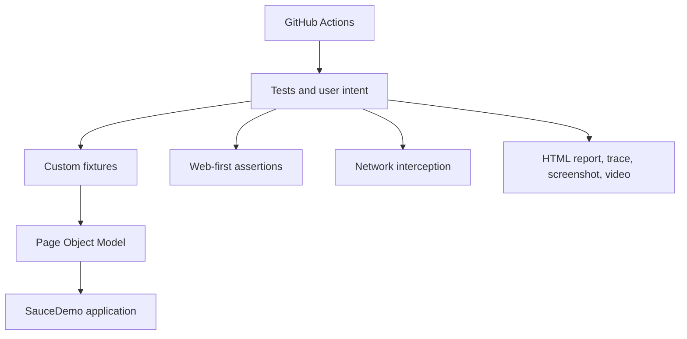

# Architecture Documentation

Status: planned, not implemented. Start Week 2 with direct tests; add page objects in Week 5 and fixtures in Week 6 only when they simplify existing code. A BasePage is optional and needs demonstrated shared behavior.

The intended automation architecture is based on Playwright and JavaScript:

The rendered architecture diagram will be added as `pom-architecture.png` during Week 14 after the implemented source structure is reviewed. The diagram must represent the actual code, not only the planned structure.

