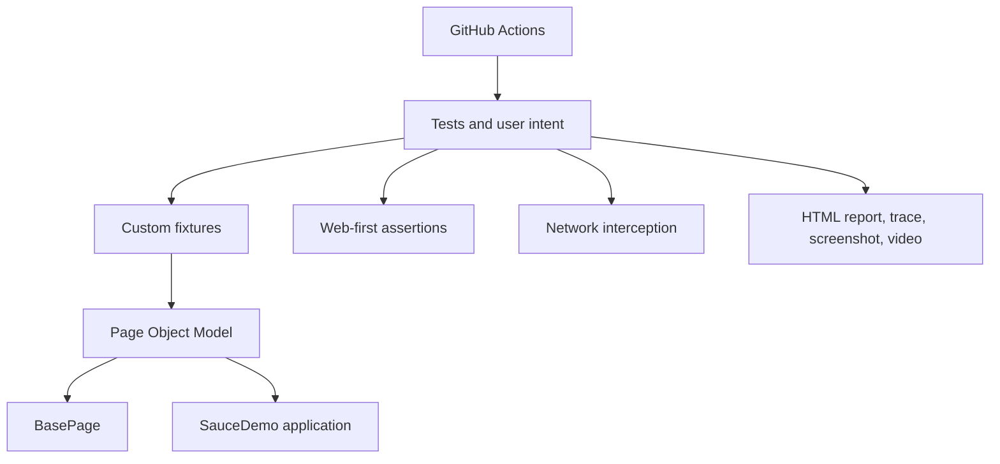

# Architecture Documentation

The intended automation architecture is based on Playwright and JavaScript:

The rendered architecture diagram will be added as `pom-architecture.png` during Week 14 after the implemented source structure is reviewed. The diagram must represent the actual code, not only the planned structure.
